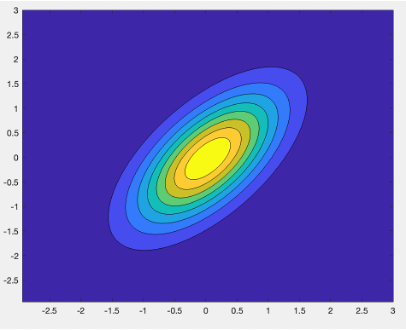
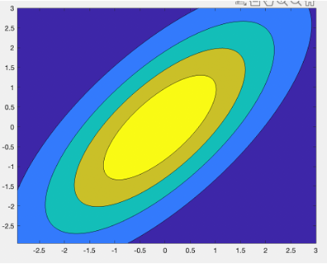

# graphicalModels

## Gausian Mixture Models Background
- A probabilistic approach to clustering (i.e. discretely categorizing) data
- Any given data point has a probability of being in each cluster
- Points in each cluster are distributed according to a Gaussian distribution N(mu, Sigma)
- Idea: fit a Gaussian mixture model to stocks in each sector to identify relationships in their price movements
- Competitive advantage hypothesis: jointly modeling the dynamics of multiple stocks in a sector can unearth interesting relationships and enable strategic pairs trading across multiple stocks

- Logistic Regression
  - Analogous to linear regression, but for classification
  - Use a linear combination of features to classify something into categories
  - Our application: use logistic regression to predict which cluster in a Gaussian mixture model will govern today's price movements for each sector. We would trade differently based on which cluster is predicted for a given day

## Methodology
- We fit a Gaussian mixture model for pairs of stocks within each of 3 sectors. 
- 2 pairs per sector for a total of 6 pairs
- We originally wanted to fit a model for each sector, but evaluating pairs of stocks made it easier to visualize and provide intuitive feedback
- The model we fit generated 3 clusters for each pair
- After fitting the Gaussian mixture model to each sectors price movements, the idea is to use logistic regression to predict which cluster each sector’s price movements will be in based on the market features

## Data
- Data was manually from Yahoo Finance

- We collected 2 types of data
  - Daily stock price data for 11 stocks across 3 industries (Oil, Medicine, Media)
  - Market variable data (e.g. market volatility, S&P 500 1-day returns, S&P 500 10-day returns)
- The time frame was daily from the beginning of 2010 to the end of 2020, with entries in 2016 designated as test data and days outside of 2016 randomly split into training vs. test data
- Split stock and market variable data into train/test with a 60/40 split

## Results
- For each stock pair, we obtained 3 key pieces of data: pi, mean, and covariance
  - Pi is a list with a value for each cluster (3 in this case). Each of these values gives the probability that an arbitrary day’s market movements will corresponding to the respective cluster
  - Mean is 2d array with dimensions being number of clusters & number of dimensions/stocks. The mean indicates the most likely price movements for each stock.
   - Covariance 3d with dimensions being number of clusters & the number of stocks repeated twice--because covariance matrix. The covariance shows how clearly separated the clusters are.

### Results: Exxon Mobil and BP
- Contour plots shown below for price movements of Exxon Mobil (x axis) and BP (y axis) for each of 3 clusters: yellow is high prob., purple is low prob.
- Cluster 1 is most prominent, followed by cluster 3, and cluster 2 is rare
- Clusters correspond to different levels of market volatility and correlation of stocks
- Clusters all reflect positive correlation between Exxon Mobil and BP
- Cluster prediction could govern: 1) options trades (e.g. straddle), 2) pairs trading: trade different amounts and in different ratios based on expected volatility and correlation of stocks

###### Figure out how to put images next to each other without using CSS

    
    
    

### Results: Media Sector
- There are 2 dominant clusters and 1 non-dominant cluster for pi.
- Cluster 3 (the non dominant cluster) captures highly volatile market conditions while clusters 1 and 2 have less uncertainty
- The clusters are somewhat well-separated but not very well-separated
- For each cluster, the price for each stock usually goes up on average

<table>
  <tr>
    <td> </td>
    <th> DISH </th>
    <th> T (AT&T) </th>
    <th> CMCSA (Comcast) </th>
    <th> DIS (Disney) </th>
  </tr>
  
  <tr>
    <td>Cluster 1 </td>
    <td> + </td>
    <td> + </td>
    <td> + </td>
    <td> + </td>
  </tr>
  
  <tr>
    <td>Cluster 2 </td>
    <td> - </td>
    <td> + </td>
    <td> + </td>
    <td> + </td>
  </tr>
  
  <tr>
    <td>Cluster 3 </td>
    <td> + </td>
    <td> - </td>
    <td> + </td>
    <td> + </td>
  </tr>  
</table>

## Conclusion
### Currently, there are still steps we need to take in the future:
- Using logistic regression on market features to identify which cluster an arbitrary day’s price - movements will be in
- Collecting more features
- Backtest the model
- Adjust the criteria for which action to take based on the cluster for an arbitrary day

###### This is readme is a transcription of the file "Graphical Models Presentation.pptx"
